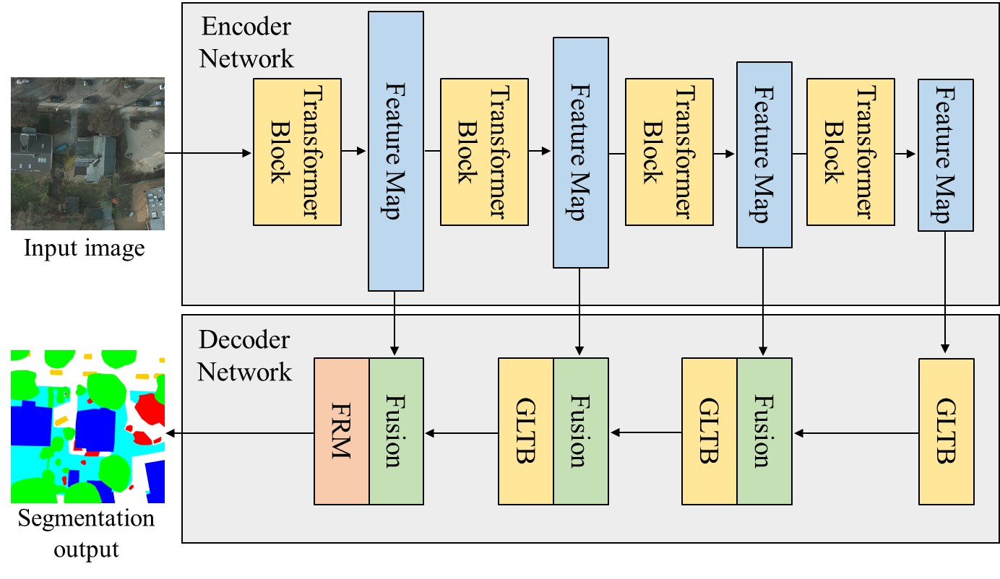
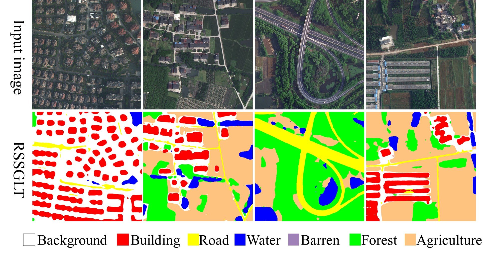

#  RSSGLT: Remote Sensing Image Segmentation Network based on Global-Local Transformer 
 

Our work can be seen in the [RSSGLT: Remote Sensing Image Segmentation Network based on Global-Local Transformer](https://ieeexplore.ieee.org/abstract/document/10335744).

- We propose RSSGLT, a novel remote sensing image segmentation network that captures intrinsic details in complex scenes. 

- We addressed the challenge of capturing both global and local features in complex scenes by leveraging a hybrid model combining transformers and convolutions.

- We used an encoder–decoder based model design which uses multiscale feature representation. We build set of modules, including an Attention Map Module, Global-Local Transformer Block and a Feature Refinement Module to achieve best possible accuracy.

Network:
------- 

<figure style="margin:0">
  
  <figcaption style="text-align:center;">Fig. 1. The schematic representation of the proposed encoder-decoder-based remote sensing image segmentation network, RSSGLT.</figcaption>
</figure>

Results:
-------- 
Quantitative result on LoveDA dataset:

|Background | Building | Road      | Water    | Barren     | Forest     | Agriculture| mIoU (%)    | 
|-----------|----------|-----------|----------|------------|------------|------------|----------| 
|  49.00    |   57.94  |  57.38    |  80.09   | 20.43      | 48.90      | 68.16      | 54.56    | 

   
  Fig. 2. The qualitative prediction results of the RSSGLT on the LoveDA test dataset.

Quantitative result on Potsdam dataset:

|Impervious surface | Building | Low vegetation | Tree   | Car     | Mean F1 (%)  | OA (%)  | mIou (%) |
|-------------------|----------|----------------|--------|---------|--------------|---------|----------| 
|  94.56            |   97.44  |  88.21         |  89.88 | 96.26   | 93.27        | 92.12   | 87.60    |

   
  Fig. 3. The qualitative prediction results of the RSSGLT on the Potsdam test dataset.

